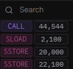

# EIP-1167: Minimal Proxy Contract

EIP-1167, which is also referred to as the minimal proxy contract, is a commonly used solidity pattern for cheaply creating proxy clones.

### Why a minimal proxy?

* For instances when you need to deploy the same contract multiple times.
* The initialization data could be different for each individual contract, but the code would be the same.
* Because deploying large contracts can be quite expensive, instead of deploying a _huge_ contract multiple times, we just deploy a super-cheap minimal proxy contract that points to the huge contract already on chain.


The cost to this pattern is that every execution has a delegate call overhead.


### What does minimal proxy do?

* All the proxy/clone contract will do is delegate all calls to the implementation
* State is updated on the proxy, while the master contract holds the necessary logic
* Several clones can point to the same implementation contract. Clones cannot be upgraded.
* The address of the implementation contract is stored in the bytecode. This saves gas compared to storage and prevents the clone from pointing to another implementation.

<figure><figcaption></figcaption></figure>


EIP 1167 has nothing to do with upgradeability nor tries to replace it.


### How does it look like?

<figure><figcaption><p>EVM bytecode</p></figcaption></figure>

* The dummy address `0xbebebebebebebebebebebebebebebebebebebebe` is replaced with the implementation contract address.
* bytecode is 55 bytes in size, or `0x37`

#### Essentially, the minimal proxy contract looks like this in pseudocode:

<figure><figcaption></figcaption></figure>

### Implementation in Solidity

* we have to create the proxy/clone contract using the 55 byte EVM bytecode above, after updating it with the implementation contract address.
* this is done with assembly in solidity&#x20;
* With assembly, we will update 0xbebebe... with the implementation address, load the entire bytes string into memory and execute it with the create opcode
* We see this process in: [https://solidity-by-example.org/app/minimal-proxy/](https://solidity-by-example.org/app/minimal-proxy/)

### Implementation with initialization

* We may want to have different initialization for clones.&#x20;
* For example, if we were cloning an ERC20 token, every clone would have the same totalSupply, which might not be desirable.
* The initializer pattern allows us to deploy the clone as if it has a constructor that takes arguments

**Process:**

1. Create an implementation contract
2. Clone the contract with the EIP-1167 standard
3. Deploy the clone and call the initialization function, which can only be called once

```solidity
contractImplementationContract{
    boolprivate isInitialized;      

    //initializer function that will be called once, during deployment.
    function initializer() external {              
        require(!isInitialized);
        // do stuff with state vars
        isInitialized =true;     
    }          
    
    // rest of the implementation functions go here 
}
```

* The initializer function has to be included in both the master as well as clone contracts.
* With this function, we can initialize state variables differently, as per use case.
* Deployed example: [https://goerli.etherscan.io/address/0x8c7a30C5e64a088e1b03E2012E9ff42398AD0DA8#code](https://goerli.etherscan.io/address/0x8c7a30C5e64a088e1b03E2012E9ff42398AD0DA8#code)


This restriction to only call once is necessary, or someone might alter the critical parameter we set after deployment, such as changing the total supply.


### MinimalProxyFactory

```solidity
contract MinimalProxyFactory {
    
    address[] public proxies;

    function deployClone(address _implementationContract) external returns (address) {
        // convert the address to 20 bytes
        bytes20 implementationContractInBytes = bytes20(_implementationContract);
        //address to assign a cloned proxy
        address proxy;
        
    
        // as stated earlier, the minimal proxy has this bytecode
        // <3d602d80600a3d3981f3363d3d373d3d3d363d73><address of implementation contract><5af43d82803e903d91602b57fd5bf3>

        // <3d602d80600a3d3981f3> == creation code which copies runtime code into memory and deploys it

        // <363d3d373d3d3d363d73> <address of implementation contract> <5af43d82803e903d91602b57fd5bf3> == runtime code that makes a delegatecall to the implentation contract
 

        assembly {
            /*
            reads the 32 bytes of memory starting at the pointer stored in 0x40
            In solidity, the 0x40 slot in memory is special: it contains the "free memory pointer"
            which points to the end of the currently allocated memory.
            */
            let clone := mload(0x40)
            // store 32 bytes to memory starting at "clone"
            mstore(
                clone,
                0x3d602d80600a3d3981f3363d3d373d3d3d363d73000000000000000000000000
            )

            /*
              |              20 bytes                |
            0x3d602d80600a3d3981f3363d3d373d3d3d363d73000000000000000000000000
                                                      ^
                                                      pointer
            */
            // store 32 bytes to memory starting at "clone" + 20 bytes
            // 0x14 = 20
            mstore(add(clone, 0x14), implementationContractInBytes)

            /*
              |               20 bytes               |                 20 bytes              |
            0x3d602d80600a3d3981f3363d3d373d3d3d363d73bebebebebebebebebebebebebebebebebebebebe
                                                                                              ^
                                                                                              pointer
            */
            // store 32 bytes to memory starting at "clone" + 40 bytes
            // 0x28 = 40
            mstore(
                add(clone, 0x28),
                0x5af43d82803e903d91602b57fd5bf30000000000000000000000000000000000
            )

            /*
            |                 20 bytes                  |          20 bytes          |           15 bytes          |
            0x3d602d80600a3d3981f3363d3d373d3d3d363d73b<implementationContractInBytes>5af43d82803e903d91602b57fd5bf3 == 45 bytes in total
            */
            
            
            // create a new contract
            // send 0 Ether
            // code starts at the pointer stored in "clone"
            // code size == 0x37 (55 bytes)
            proxy := create(0, clone, 0x37)
        }
        
        // Call initialization
        ImplementationContract(proxy).initializer();
        proxies.push(proxy);
        return proxy;
    }
}
```

* array of addresses, `proxies`, is optional. Serves to keep a list of clones deployed.

### Links

* [https://www.youtube.com/watch?v=9xqoK2nKkM4](https://www.youtube.com/watch?v=9xqoK2nKkM4)
* [https://www.rareskills.io/post/eip-1167-minimal-proxy-standard-with-initialization-clone-pattern](https://www.rareskills.io/post/eip-1167-minimal-proxy-standard-with-initialization-clone-pattern)
* [https://solidity-by-example.org/app/minimal-proxy/](https://solidity-by-example.org/app/minimal-proxy/)
* [https://blog.openzeppelin.com/deep-dive-into-the-minimal-proxy-contract/](https://blog.openzeppelin.com/deep-dive-into-the-minimal-proxy-contract/)
