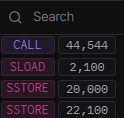

# Memory caching vs direct storage vs pointers

## Gas notes

#### Avoid zero to one storage writes where possible

Initializing a storage variable is one of the most expensive operations a contract can do.&#x20;

When a storage variable goes from **zero** to **non-zero**, the user must pay **22,100** gas total (20,000 gas for a zero to non-zero write and 2,100 for a cold storage access).

This is why the Openzeppelin reentrancy guard registers functions as active or not with 1 and 2 rather than 0 and 1. **It only costs 5,000 gas to alter a storage variable from non-zero to non-zero.**&#x20;


## Reading & Writing #1

* each function writes to a different stream to avoid overwriting each other

```solidity
// SPDX-License-Identifier: UNLICENSED
pragma solidity 0.8.24;

contract GasCostsV2 {

    struct Stream {
        // slot 0
        uint256 claimed;
        // slot 1
        uint256 lastClaimedTimestamp;
    }

    mapping(uint256 tokenId => Stream stream) public streams;
        
    function testMemory() public {
        
        //cache
        Stream memory stream = streams[1];

        //doStuff
        stream.claimed += 10 ether;
        stream.lastClaimedTimestamp = block.timestamp;
        
        //update storage
        streams[1] = stream;
    }

    function testStorage() public {
              
        //doStuff
        streams[2].claimed += 10 ether;
        streams[2].lastClaimedTimestamp = block.timestamp;
    }

    
    function testPointers() public {
        
        // pointer
        Stream storage stream = streams[3];
        
        //doStuff
        stream.claimed += 10 ether;
        stream.lastClaimedTimestamp = block.timestamp;
    }
}
```

**Gas used**

* storage: 66,540
* memory: 66,621
* pointer: 66,474

Memory cost the most gas, and pointers the least.&#x20;

Link: [https://sepolia.arbiscan.io/address/0xfa4123e66ddbde65a7be3e58c9472095799b479d](https://sepolia.arbiscan.io/address/0xfa4123e66ddbde65a7be3e58c9472095799b479d)&#x20;

### Why does caching to memory cost more than storage?

**testStorage** uses the following opcodes:

<figure><figcaption></figcaption></figure>

* `sload` to load the value of `streams[2].claimed` to stack for the incrementation operation
* Two `sstore` to store the updated value of claimed and timestamp

**testMemory** uses the following opcodes:

<figure><figcaption></figcaption></figure>

* **Two `sload`** to load both uint256 values to memory&#x20;
* Two `sstore` to store the updated value of claimed and timestamp

**TestMemory has an extra sload due to caching.**

#### Links

* storage: [https://dashboard.tenderly.co/tx/arbitrum-sepolia/0x25660453cb8bc3df455bb00e4c43f0c72bcf3650c2df34ab9a538d80808bb5ad](https://dashboard.tenderly.co/tx/arbitrum-sepolia/0x25660453cb8bc3df455bb00e4c43f0c72bcf3650c2df34ab9a538d80808bb5ad)
* memory: [https://dashboard.tenderly.co/tx/arbitrum-sepolia/0xe73912870f63f515b68e7df515eca894184d996fae3f54ac4de61d267abaff87](https://dashboard.tenderly.co/tx/arbitrum-sepolia/0xe73912870f63f515b68e7df515eca894184d996fae3f54ac4de61d267abaff87)

## Reading & Writing #2&#x20;

What if we do not increment?&#x20;

```solidity
contract GasCostsV2 {

    struct Stream {
        // slot 0
        uint256 claimed;
        // slot 1
        uint256 lastClaimedTimestamp;
    }

    mapping(uint256 tokenId => Stream stream) public streams;
        
    function testMemory() public {
        
        //cache
        Stream memory stream = streams[1];

        //doStuff
        stream.claimed = 10 ether;
        stream.lastClaimedTimestamp = block.timestamp;
        
        //update storage
        streams[1] = stream;
    }

    function testStorage() public {
              
        //doStuff
        streams[2].claimed = 10 ether;
        streams[2].lastClaimedTimestamp = block.timestamp;
    }

    
    function testPointers() public {
        
        // pointer
        Stream storage stream = streams[3];
        
        //doStuff
        stream.claimed = 10 ether;
        stream.lastClaimedTimestamp = block.timestamp;
    }
}
```

**Gas used**

* storage: 68,329
* memory: **68,379**
* pointer: 68,263

Memory cost the most gas, and pointers the least.&#x20;

Contract: [https://sepolia.arbiscan.io/address/0xe8dc0444916cbfbc70949878a673ad535f481cd7](https://sepolia.arbiscan.io/address/0xe8dc0444916cbfbc70949878a673ad535f481cd7)

### Why does caching to memory cost more than storage?

Caching to memory costs 50 gas units more than writing to storage directly.

## When to cache to memory?

#### Cache storage variables: write and read storage variables exactly once

```solidity
// SPDX-License-Identifier: MIT
pragma solidity 0.8.20;

contract Counter1 {
    uint256 public number;

    function increment1() public {
        require(number < 10);
        number = number + 1;
    }
}

contract Counter2 {
    uint256 public number;

    function increment2() public {
        uint256 _number = number;
        require(_number < 10);
        number = _number + 1;
    }
}
```

* `increment1` reads number from storage multiple times; each subsequent SLOAD after the first costs 100 gas
* `increment2` caches to avoid repeated SLOADs

