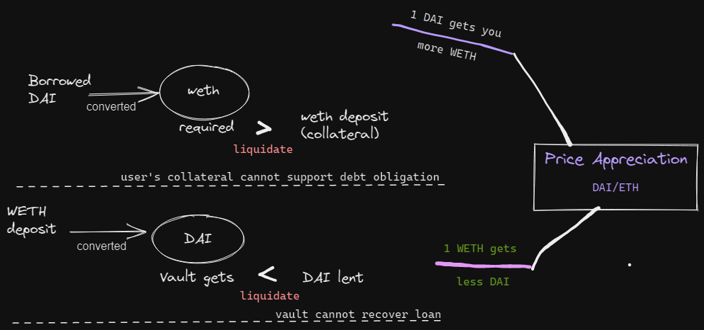

# #5 Collateralized Vault

* Problem Statement: [https://github.com/yieldprotocol/mentorship2022/issues/5](https://github.com/yieldprotocol/mentorship2022/issues/5)
* Github: [https://github.com/calnix/Collateralized-Vault](https://github.com/calnix/Collateralized-Vault)

## Objective

Contract allows users to deposit an asset they own (collateral), to **borrow a different asset** that the Vault owns (underlying).&#x20;

* Exchange rate determined by oracle;&#x20;
* if value of collateral drops in underlying terms, the user will be liquidated.
* #### For example, user can deposit WETH as collateral, and borrow DAI against it.

### Sequence

1. Users deposit WETH into Vault
2. Users _**borrow**_ DAI against their WETH collateral
3. Loan is considered healthy as long as the <mark style="color:red;">Vault does not lose money.</mark>
   1. <mark style="color:blue;">**This happens when**</mark><mark style="color:red;">**:**</mark>
      1. the weth collateral held by the Vault is worth less than DAI lent
      2. Vault cannot sell weth at market price to collect back DAI lent
   2. **This occurs when price appreciates:**
      1. Initial DAI/WETH price: 0.00038637284
         * _<mark style="color:red;">**price appreciation**</mark>_
         * 1 DAI : 0.38637284 WETH
      2. 1 DAI gets your more WETH
      3. But that means to get the same amount of DAI, Vaul <mark style="color:red;">**needs more WETH.**</mark>
4. **Liquidation occurs when the WETH collateral, calculated in weth terms.**
   1. if value of collateral drops in underlying terms, the user will be liquidated.

### Tokens

* Collateral: WETH&#x20;
* Underlying: DAI

### Contracts

1. Pull the contract code for both from Etherscan
2. Ensure there is a mint() function that allows you to obtain as much as you need for testing.

## Workflow

1. Users deposit WETH into Vault,
   * (Vault records WETH deposited by each user)
2. Users _borrow_ DAI against their WETH collateral
   * maximum amt of DAI borrowable
     * DAI\_value\_in\_WETH < WETH Collateral
   * Vault transfers DAI to the users.
   * Vault owner finances DAI to the Vault on construction.
3. Exchange rate: Chainlink Oracle \[https://docs.chain.link/docs/ethereum-addresses]
4. Users repay debt in DAI
5. Withdrawal
   * To withdraw WETH, the users must repay the DAI they borrowed.
6. Liquidation
   * If DAI/ETH price appreciates such tt **debt\_value** _>_ **collateral\_value**, Vault will erase user records from the contract&#x20;
   * \-> cancelling the user debt, and at the same time stopping that user from withdrawing their collateral.

####
